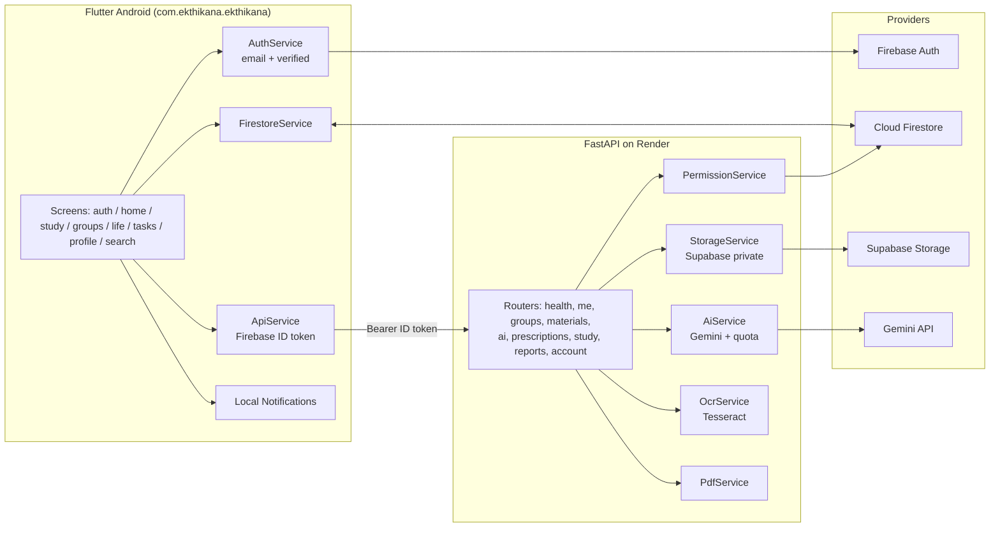
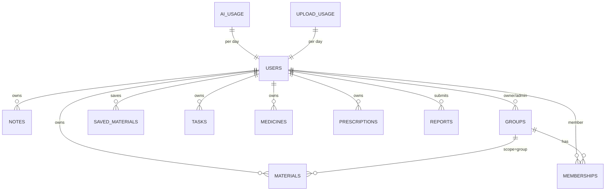

## Plan: EkThikana Audit & Finalize

**TL;DR.** The repository already contains a near-complete EkThikana scaffold (FastAPI backend with all required routers, Flutter screens for every module, Firestore rules, docs, tests). This plan **does not rewrite working code**. It (1) writes `PROJECT_SPEC.md` and `TODO.md`, (2) audits existing code against the spec, (3) in each subsequent phase modifies **only** what is incomplete, broken, insecure, or inconsistent — never refactoring for style, and (4) performs the final production audit. No real secrets are ever written; only `.env.example` is updated.

### Working rule (applies to every phase)

For each phase: **audit first, then modify only what is incomplete, broken, insecure, or inconsistent.** Do not rename, reformat, reorganize, or "improve" files that already satisfy the spec. Every code change must be traceable to a specific spec bullet, audit finding, failing test, security check, or lint error. Preserve the existing architecture, module map, and data model.

### Architecture overview (current)

### Data ownership (current scaffold)

### Phases

**Phase 0 — Spec & tracking (read-only, no code changes).**

1. (depends on nothing) Write `PROJECT_SPEC.md` from the user request — verbatim feature/security/API/repo requirements, config defaults (15 MB/file, 100 MB/user, 10 uploads/day, 30 AI req/day), and the "excluded" list (no MCQ, no group chat, no auto question gen).
2. (parallel with 1) Write `TODO.md` with the phase list below, each phase a checklist of concrete deliverables and an "external credentials" subsection.
3. (depends on 1, 2) Write `.env.example` updates documenting every env var referenced by `backend/app/core/config.py`, with placeholder values only.
4. **Phase 0 security check:** confirm `PROJECT_SPEC.md` lists every required backend route from the spec.

**Phase 1 — Audit & gap report (read-only; produces the change list).**

1. (depends on Phase 0) Read every file under `backend/app/` and `flutter_app/lib/` and cross-check against `PROJECT_SPEC.md`.
2. Produce `docs/AUDIT_REPORT.md` listing: ✅ present, ⚠️ partial, ❌ missing for each requirement (auth, role gating, study, materials, groups, community, AI, daily-life, notifications, search, profile/export/delete, security).
3. From the audit, derive the **minimal** change list for Phases 2–10. Anything already ✅ is **not** touched.
4. **Phase 1 security check:** verify each router has Firebase-ID-token verification and email-verified check; verify `require_student` is enforced on study/AI/community/group endpoints; verify `firestore.rules` denies client writes to `reports`, `ai_usage`, `upload_usage`.

**Phase 2 — Auth & role gating (fix only gaps from audit).**

1. (depends on 1) If audit shows a gap, fix in `backend/app/core/auth.py`: `CurrentUser`, `require_student`, role lookup from `users/{uid}` (never trust client).
2. If audit shows a gap, fix `flutter_app/lib/services/auth_service.dart`: sign in, `emailVerified` gating, role stream, account deletion with reauth.
3. If audit shows a gap, fix `flutter_app/lib/screens/home/home_shell.dart` to hide Study/Groups for General users.
4. If audit shows a gap, fix `firestore.rules` to deny client role changes.
5. **Phase 2 security check:** add/adjust tests in `backend/tests/test_auth_and_roles.py` covering: missing token (401), unverified email (403), wrong role on student endpoint (403), role-tampering attempt rejected by Firestore rules — **only** for cases not already covered.

**Phase 3 — Study (Semester → Subject → Notes/Materials; fix only gaps).**

1. (depends on 2) If audit shows a gap, fix screens in `flutter_app/lib/screens/study/`.
2. Confirm note visibility enum `private | group | public` is enforced by `permission_service.py`; fix only if enforcement is missing or wrong.
3. Confirm AI features are routed through backend only (`/api/ai/note`, `/api/ai/pdf-question`, `/api/study/plan`); fix only if a client bypass exists.
4. **Phase 3 security check:** no MCQ / auto-question endpoints exist (delete if accidentally present); no AI key in Flutter; AI quota counter (`ai_usage`) increments server-side only.

**Phase 4 — PDF reader & storage (fix only gaps).**

1. (depends on 3) If audit shows a gap, fix `material_reader_screen.dart`: built-in reader, text selection/search, last-page resume, page bookmarks, page-linked notes.
2. If audit shows a gap, fix `materials.py`: file signature validation (PDF/PNG/JPEG), filename sanitization, randomized storage paths, short-lived signed URLs, 15 MB / 100 MB / 10 uploads/day limits.
3. If audit shows a gap, fix `storage_service.py` to ensure Supabase service-role key only; no Render-disk persistence.
4. **Phase 4 security check:** signed URL TTL ≤ 15 min; non-owner private denied; group material requires membership. Fix only if any check fails.

**Phase 5 — Groups (fix only gaps).**

1. (depends on 2) If audit shows a gap, fix `groups.py` and screens for create/join/leave/reset-invite, owner+admins+members model, no chat/messaging surface.
2. If a chat/message doc type exists anywhere, **remove it** (spec forbids it).
3. **Phase 5 security check:** admin-only invite reset; only owner/admin can remove others; non-member cannot read group materials; invite-code semantics adequate. Fix only where failing.

**Phase 6 — Community Library (fix only gaps).**

1. (depends on 3) If audit shows a gap, fix `community_screen.dart` and `saved_materials_screen.dart` for filters (university, department, semester, subject, type), search, sort (newest, most saved), preview, save, download, report.
2. If `reports.py` does not enforce server-side write, fix it; Firestore rules must block client writes.
3. **Phase 6 security check:** verified-Student-only public read; `saved_materials.originalOwnerId` preserved; report dedupe per `reporter+material`. Fix only where failing.

**Phase 7 — Study AI (fix only gaps).**

1. (depends on 3) If audit shows a gap, fix `ai_service.py`: Gemini call, retry/timeout, quota, prompt safety (no MCQ generation), page-targeted PDF text extraction.
2. If `pdf_service.py` allows unbounded extraction, cap it.
3. **Phase 7 security check:** AI key read from env only; daily quota enforced server-side; responses sanitized. Fix only where failing.

**Phase 8 — Daily-Life (Student + General; fix only gaps).**

1. (depends on 2) If audit shows a gap, fix screens for: Tasks, Reminders, Medicine, Prescription OCR, BazarBuddy, FamilyHub, RentMate, CommuteBD, Wellness.
2. Confirm prescription flow: upload → OCR → show text → user confirms fields → save. **Never auto-trust.** Fix only if auto-save exists.
3. **Phase 8 security check:** OCR endpoint does not auto-write medicine records; saved medicine record requires a `confirmedByUser: true` flag set by the client after user review. Fix only where missing.

**Phase 9 — Search, notifications, profile/export/delete (fix only gaps).**

1. (depends on 2) If audit shows a gap, fix `universal_search_screen.dart` for role-aware results.
2. If audit shows a gap, fix `notification_service.dart` for timezone (`Asia/Dhaka`).
3. If audit shows a gap, fix profile screen for data export (`GET /api/account/export`) and account deletion (`DELETE /api/account`, cascade Auth+Firestore+Supabase), confirmation dialog.
4. **Phase 9 security check:** export contains only the requesting user's data; deletion is irreversible and audited in `docs/SECURITY_PRIVACY.md`. Fix only where failing.

**Phase 10 — Production & security hardening (fix only gaps).**

1. (depends on all prior) If audit shows gaps, fix `firebase.json`, `render.yaml`, `Dockerfile`, `firestore.indexes.json`, `.gitignore`.
2. If CORS is wildcarded in production, restrict it via env (`CORS_ORIGINS`).
3. Run `pytest backend/tests/` and `flutter analyze`; fix **only** errors caused by our edits or pre-existing failures.
4. Update `docs/PRODUCTION_CHECKLIST.md` and `docs/BUILD_VALIDATION.md` with the actual run results.

**Phase 11 — Final audit (read-only).**

1. (depends on 10) Re-walk `PROJECT_SPEC.md` line by line; every ✅ must be backed by file:line evidence in `docs/FINAL_AUDIT.md`.
2. Only after that file is fully ticked do we mark the project production-ready.

### Relevant files

- `PROJECT_SPEC.md` — *new* — single source of truth for every requirement.
- `TODO.md` — *new* — phase-by-phase checklist + external-credentials list.
- `.env.example` — *update only if a new env var is needed* — document every env var used by `backend/app/core/config.py`.
- `docs/AUDIT_REPORT.md` — *new* — Phase 1 gap report.
- `docs/FINAL_AUDIT.md` — *new* — Phase 11 evidence dump.
- `backend/app/core/auth.py` — modify only if audit flags a gap.
- `backend/app/core/config.py` — modify only if audit flags a gap.
- `backend/app/services/permission_service.py` — modify only if audit flags a gap.
- `backend/app/services/storage_service.py` — modify only if audit flags a gap.
- `backend/app/services/ai_service.py` — modify only if audit flags a gap.
- `backend/app/services/pdf_service.py` — modify only if audit flags a gap.
- `backend/app/routers/*.py` — modify only if audit flags a gap.
- `flutter_app/lib/services/auth_service.dart` — modify only if audit flags a gap.
- `flutter_app/lib/services/api_service.dart` — modify only if audit flags a gap.
- `flutter_app/lib/screens/home/home_shell.dart` — modify only if audit flags a gap.
- `flutter_app/lib/screens/study/material_reader_screen.dart` — modify only if audit flags a gap.
- `flutter_app/lib/screens/life/medicine_screen.dart` — modify only if audit flags a gap.
- `firebase/firestore.rules` — modify only if audit flags a gap.
- `firebase/firestore.indexes.json` — modify only if audit flags a gap.
- `backend/tests/*.py` — add/adjust tests only for cases not already covered.
- `docs/PRODUCTION_CHECKLIST.md`, `docs/BUILD_VALIDATION.md` — record final results.

### Verification

1. `cd backend && pytest -q` — all tests green.
2. `cd flutter_app && flutter analyze` — zero issues.
3. `cd flutter_app && flutter build apk --debug` — build succeeds.
4. `docs/FINAL_AUDIT.md` — every spec bullet has a ✅ with file:line evidence.
5. `TODO.md` — every phase box ticked; "External credentials still required" section lists only Firebase/Supabase/Gemini placeholders.
6. Working rule check: `git diff --stat` after each phase must show changes only in files that audit flagged.
