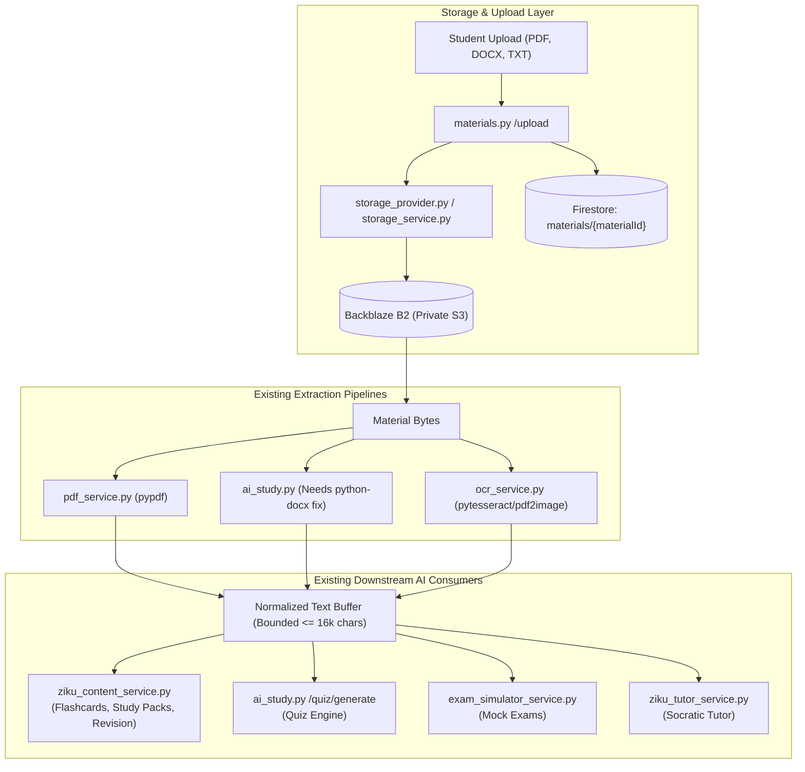
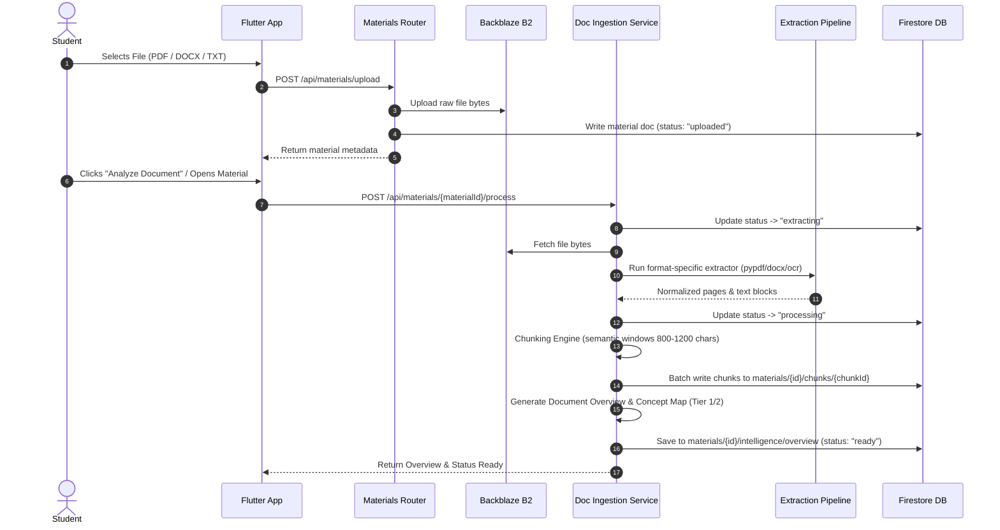
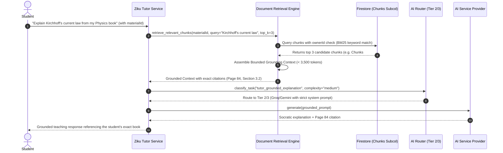
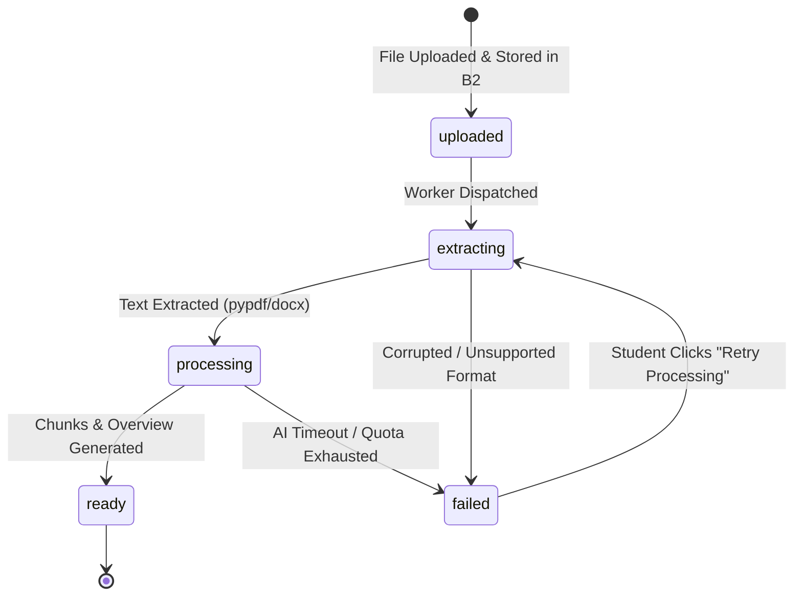

# Phase 14.1 — Ziku AI Document Intelligence: Architecture Audit & Foundation Plan

**Project:** Gochano / EkThikana
**Milestone:** Phase 14 — Ziku AI Document Intelligence
**Step:** Phase 14.1 — Architecture Audit & Foundation Plan
**Status:** Completed & Grounded in Production Repository
**Date:** October 3, 2026

---

## 1. Executive Summary & Verification Context

Phase 1 through Phase 12 (including the full Phase 12.2 Production Hardening series: AI Timeout Hardening, Firestore Scaling, Dashboard Bootstrap, Intelligence Consolidation, and Legacy Cleanup) are completed and verified in production. Phase 13 Voice is intentionally deferred.

The next major capability leap is **Phase 14: Ziku AI Document Intelligence**. This phase transforms static student-uploaded study materials (textbook PDFs, lecture slides, DOCX notes, image scans, and markdown notes) into interactive, explainable, and grounded academic intelligence.

### Architectural Imperative: Zero Duplication
Document Intelligence must **NOT** create:
- A second extraction engine (must reuse [`pdf_service.py`](file:///d:/Gochano_Rebuild/backend/app/services/pdf_service.py), `python-docx`, and [`ocr_service.py`](file:///d:/Gochano_Rebuild/backend/app/services/ocr_service.py)).
- A second storage or file-upload system (must reuse [`storage_provider.py`](file:///d:/Gochano_Rebuild/backend/app/services/storage_provider.py), [`storage_service.py`](file:///d:/Gochano_Rebuild/backend/app/services/storage_service.py), and collection `materials`).
- A second quiz generation engine (must reuse `app.routers.ai_study.quiz_generate`).
- A second content generation pipeline (must reuse [`ziku_content_service.py`](file:///d:/Gochano_Rebuild/backend/app/services/ziku_content_service.py)).
- A second AI provider cascade (must reuse [`ai_service.py`](file:///d:/Gochano_Rebuild/backend/app/services/ai_service.py) and [`ai_router_service.py`](file:///d:/Gochano_Rebuild/backend/app/services/ai_router_service.py)).
- A second Socratic tutoring system (must ground the canonical [`ziku_tutor_service.py`](file:///d:/Gochano_Rebuild/backend/app/services/ziku_tutor_service.py)).
- A second learning memory or mastery tracker (must feed [`learning_memory_service.py`](file:///d:/Gochano_Rebuild/backend/app/services/learning_memory_service.py)).

This document establishes the architecture audit, technical contracts, chunking strategy, RAG/retrieval decision, data schemas, security guardrails, and phased implementation roadmap for Phase 14.

---

## 2. Audit of Existing Document & Extraction Pipelines

### 2.1 PDF Extraction
- **Canonical File:** [`backend/app/services/pdf_service.py`](file:///d:/Gochano_Rebuild/backend/app/services/pdf_service.py)
- **Engine:** `pypdf.PdfReader` (version $\ge 5.0$ in `requirements.txt`).
- **Signature:** `extract_pdf_text(data: bytes, page: int | None = None, max_chars: int = 70000, max_pages: int | None = None) -> str`
- **Audit Findings:**
  - Fast, in-memory, pure-python extraction from `BytesIO(data)`.
  - Capable of single-page or multi-page extraction (`pages[:max_pages]`).
  - Current limitation: extracts text sequentially and flattens all pages into a single string (`"\n\n".join(chunks)`), discarding per-page boundary tags and heading structure.
  - **Phase 14 Extension:** Extend with a page-aware generator `extract_pdf_pages(data: bytes, max_pages: int = 200) -> list[tuple[int, str]]` returning `(page_number, text)` tuples so chunks preserve exact page provenance.

### 2.2 DOC / DOCX Extraction
- **Current State:**
  - In [`backend/app/routers/ai_study.py`](file:///d:/Gochano_Rebuild/backend/app/routers/ai_study.py) lines 384–388:
    ```python
    # DOC / DOCX / TXT — read as text
    raw = _material_bytes(material)
    return raw.decode("utf-8", errors="ignore")[:8000]
    ```
  - **Defect Identified in Audit:** DOCX files are zipped XML packages (`PK\x03\x04`). Raw UTF-8 decoding outputs binary XML artifacts, schema tags, and corrupted fragments instead of human-readable text.
  - **Available Dependency:** `python-docx>=1.1,<2` is already installed and pinned in `backend/requirements.txt`.
  - **Phase 14 Remediation:** Create a canonical `extract_docx_text(data: bytes) -> list[tuple[str, str]]` utilizing `docx.Document(BytesIO(data))` to extract structured paragraph and heading blocks (`heading_1`, `heading_2`, `body`), with graceful fallback for legacy binary `.doc` files.

### 2.3 TXT Extraction & Raw Notes
- **Material TXT:** UTF-8 decoded with `replace`/`ignore` error handling in [`ai_study.py`](file:///d:/Gochano_Rebuild/backend/app/routers/ai_study.py).
- **In-App Student Notes:** Handled in `_extract_note_text(user, note_id)` from collection `users/{uid}/notes/{noteId}`. Clean markdown text up to 10,000 characters.

### 2.4 OCR Pipeline
- **Canonical Files:** [`backend/app/services/ocr_service.py`](file:///d:/Gochano_Rebuild/backend/app/services/ocr_service.py) and `backend/app/services/ocr/` (`recognition.py`, `preprocess.py`, `medicine_names.py`).
- **Dependencies:** `pytesseract>=0.3.13`, `pdf2image>=1.17`, `pillow>=11`.
- **Capability:** Preprocesses images (grayscale, thresholding, deskewing) and runs Tesseract OCR. Converts scanned PDF pages into PIL Images via `pdf2image.convert_from_bytes`. Returns `Extraction` dataclass with `RecognitionResult` confidence score.
- **Phase 14 Application:** When a PDF has zero text layer (scanned document) or image upload (handwritten study notes, blackboard captures), the OCR pipeline provides optical recognition fallback per page.

### 2.5 Storage Provider & Material Ownership
- **Canonical Files:** [`backend/app/services/storage_provider.py`](file:///d:/Gochano_Rebuild/backend/app/services/storage_provider.py), [`backend/app/services/storage_service.py`](file:///d:/Gochano_Rebuild/backend/app/services/storage_service.py), [`backend/app/routers/materials.py`](file:///d:/Gochano_Rebuild/backend/app/routers/materials.py).
- **Storage Target:** Backblaze B2 (S3-compatible API via `boto3`) with fallback to legacy Firebase Storage for unmigrated assets.
- **Material Ownership Model:**
  - Collection: `materials/{materialId}`
  - Documents have: `ownerId`, `title`, `fileName`, `filePath`, `mimeType`, `sizeBytes`, `visibility` (`private` | `group`), `subject`, `createdAt`.
  - Authorization: `_get_material_owned_by(material_id, user)` strictly gates read/mutation to the owning student UID (or verified group member).
  - Storage paths: `users/{user.uid}/{uuid}_{filename}`.
- **Phase 14 Application:** All document intelligence features must reference `materialId` directly. Zero duplicate files will be stored in B2.

### 2.6 AI Content Studio
- **Canonical File:** [`backend/app/services/ziku_content_service.py`](file:///d:/Gochano_Rebuild/backend/app/services/ziku_content_service.py).
- **Functions:**
  - `generate_explanation(uid, topic=..., source=...)`
  - `generate_flashcards(uid, topic=..., source=..., count=10)`
  - `generate_revision_sheet(uid, topic=..., source=...)`
  - `generate_study_pack(uid, topic=..., source=...)`
- **Output Storage:** Collection `ai_content/{contentId}` with `studentId`, `type`, `topic`, `sourceMaterial`, `generatedContent`.
- **Phase 14 Application:** When generating flashcards, revision sheets, or study packs from a document, call `ziku_content_service` directly using document chunks as bounded `source`.

### 2.7 Quiz Engine & Exam Simulator
- **Quiz Engine:** [`backend/app/routers/ai_study.py`](file:///d:/Gochano_Rebuild/backend/app/routers/ai_study.py) (`quiz_generate`). Takes `source_ids: list[str]`, extracts text, generates server-graded questions, updates Mistake Memory and Learning Memory.
- **Exam Simulator:** [`backend/app/services/exam_simulator_service.py`](file:///d:/Gochano_Rebuild/backend/app/services/exam_simulator_service.py) (`create_exam`). Takes `material_text: str`, builds full mock exams with time limits, negative marking, and proctoring.
- **Phase 14 Application:** Document intelligence triggers quiz/exam creation using the document's synthesized key topics and chunk context without duplicating quiz generation logic.

### 2.8 Ziku Tutor & Learning Memory
- **Ziku Socratic Tutor:** [`backend/app/services/ziku_tutor_service.py`](file:///d:/Gochano_Rebuild/backend/app/services/ziku_tutor_service.py). Manages multi-turn Socratic sessions (`start_session`, `submit_response`, `request_hint`), dynamically adjusting difficulty based on student adaptation.
- **Learning Memory:** [`backend/app/services/learning_memory_service.py`](file:///d:/Gochano_Rebuild/backend/app/services/learning_memory_service.py). Canonical source of concept mastery (`get_topic_mastery`, `get_all_topics_mastery`).
- **Phase 14 Application:** Ziku Tutor accepts an optional `materialId`. Grounded turns retrieve the exact section of the student's book to formulate questions and evaluate answers with precise book citations.

### 2.9 Existing Document Flow Dependency Map



---

## 3. Product Capabilities Specification (Phase 14 Scope)

Document Intelligence transforms any uploaded student material into 10 structured academic capabilities:

```
                                  [ Uploaded Document ]
                                            │
               ┌────────────────────────────┼────────────────────────────┐
               ▼                            ▼                            ▼
      A. Document Overview           B. Smart Summary           C. Chapter / Concept Map
      - Title, Subject, Chapter      - Short (< 150 words)       - Interactive hierarchy
      - Estimated Reading Time       - Comprehensive             - Prerequisite links
      - Section Outline              - Exam-Focused Checklist    - Core Formulas Table
               │                            │                            │
               ├────────────────────────────┼────────────────────────────┤
               ▼                            ▼                            ▼
      D. Important Topics            E. Flashcards               F. Quiz Generation
      - Ranked by Exam Relevance     - Generated via Phase 10    - MCQ & Short Answer
      - Evidence with Page Cites     - Spaced Repetition Ready   - Instant Grading
      - Key Theorems / Rules         - Term-to-Definition        - Mistake Tracking
               │                            │                            │
               ├────────────────────────────┼────────────────────────────┤
               ▼                            ▼                            ▼
      G. Revision Sheet              H. Study Pack               I. Grounded Tutor
      - 1-Page Exam Cheat Sheet      - Consolidated bundle       - "Explain p. 42 rule"
      - Common Traps & Errors        - Summary + Cards + Quiz    - Page-accurate hints
               │                            │                            │
               └────────────────────────────┴────────────────────────────┘
                                            │
                                            ▼
                                  J. Exam Integration
                                  - 25-Question Mock Exam
                                  - Timed Simulation
                                  - Ties to Exam Rescue
```

### Detailed Capability Contracts:

| Capability | Product Contract | Output Schema / Fields | Reused Engine |
| :--- | :--- | :--- | :--- |
| **A. Overview** | Extracted upon upload; classifies subject, chapter, page count, and reading duration. | `title`, `subject`, `chapter`, `pageCount`, `wordCount`, `estimatedReadMinutes`, `detectedSections: list[str]` | Tier 1 AI Router + PDF metadata |
| **B. Smart Summary** | Three distinct summary depths tailored for initial skimming, in-depth study, or last-minute exam prep. | `short` (100–150 words), `detailed` (bulleted multi-section overview), `examFocused` (high-yield exam points) | Tier 2 AI Router via `ai_service` |
| **C. Concept Map** | Graph of concepts and formulas with dependency ordering. | `concepts: list[{"name": str, "description": str, "prerequisites": list[str], "formulas": list[str]}]` | Tier 2 AI Router |
| **D. Important Topics** | Top topics ranked by importance with exact source page evidence. Zero fabricated claims. | `topics: list[{"topic": str, "importanceScore": float, "sourcePages": list[int], "keyInsight": str}]` | Tier 2 AI Router + Chunk index |
| **E. Flashcards** | 10–25 question-answer study cards linked to document sections. | Array of cards with `question`, `answer`, `difficulty`, `sourcePage`. Stored in `ai_content`. | [`ziku_content_service.generate_flashcards`](file:///d:/Gochano_Rebuild/backend/app/services/ziku_content_service.py) |
| **F. Quiz Generation** | 5–15 practice questions derived directly from the document's verified content. | Full quiz payload with options, correct answer, explanation, source page. Saved to user quizzes. | `app.routers.ai_study.quiz_generate` |
| **G. Revision Sheet** | Single-page rapid review sheet with formulas, common traps, and checklist. | `importantFormulas`, `confusedConcepts`, `lastMinuteChecklist`, `practiceQuestions`. Stored in `ai_content`. | [`ziku_content_service.generate_revision_sheet`](file:///d:/Gochano_Rebuild/backend/app/services/ziku_content_service.py) |
| **H. Study Pack** | One-click bundle compiling Summary, Flashcards, Quiz, and Revision Sheet into a unified study kit. | Consolidated payload referencing child artifacts. Stored in `ai_content`. | [`ziku_content_service.generate_study_pack`](file:///d:/Gochano_Rebuild/backend/app/services/ziku_content_service.py) |
| **I. Grounded Tutor** | Socratic tutor answers student queries grounded in selected document chunks with page citations. | Tutor turn with grounded explanation, Socratic prompt, citation: `{"sourcePage": int, "section": str}`. | [`ziku_tutor_service.py`](file:///d:/Gochano_Rebuild/backend/app/services/ziku_tutor_service.py) |
| **J. Exam Simulator** | Generates a 25-question timed mock exam matching Bangladesh curriculum or board syllabus. | Complete exam attempt with negative marking, server-side grading, and mistake logging. | [`exam_simulator_service.create_exam`](file:///d:/Gochano_Rebuild/backend/app/services/exam_simulator_service.py) |

---

## 4. Document Ingestion Architecture

### 4.1 Ingestion Flow Pipeline



### 4.2 Retrieval & Indexing Decision: Vector DB vs. Lexical vs. Hybrid

A critical requirement of Phase 14.1 is deciding whether a dedicated vector database (e.g. Pinecone, Qdrant, Milvus, pgvector) is justified or if lexical/structural retrieval is superior for the Gochano repository scale.

#### Architectural Tradeoff Evaluation:

| Criterion | Dedicated Vector DB (Pinecone/Qdrant) | Cloud pgvector / Supabase Vector | Structured Lexical Retrieval (BM25 + Firestore Chunks) |
| :--- | :--- | :--- | :--- |
| **Infrastructure Overhead** | High ($70–$150/mo minimum fixed cluster cost; new network hops; API keys). | Moderate (requires managing embeddings table and vector indexes in PostgreSQL). | **Zero extra infrastructure** (uses existing Firestore and local Python search). |
| **Student Data Scale** | Overkill. Average student has 5–30 documents, each 10–200 pages (~50–600 chunks). Total active chunks per student $< 15,000$. | Good, but requires sync pipelines between Firestore and PostgreSQL. | **Optimal**. Scoped per-document retrieval operates over $< 500$ chunks per document. |
| **Exact Term Precision** | Poor for specific formulas, law names, and chapter numbers (vectors often conflate Ohm's law with Kirchhoff's law due to semantic proximity). | Moderate (hybrid requires dual scoring). | **Superior for academic terms**: Exact keyword matching on terms like *"Kirchhoff's Voltage Law"*, *"Equation 3.2"*, *"Chloroplast"*. |
| **Latency** | 150ms – 400ms external API roundtrip. | 50ms – 100ms database query. | **< 15ms** in-memory / local scoring over the document's cached chunk manifest. |
| **Cold-Start & Privacy** | Higher risk of accidental multi-tenant cross-contamination unless strict tenant namespaces are verified. | Strict SQL `WHERE student_id = :uid`. | **Guaranteed multi-tenant isolation**: Queries are strictly path-scoped to `materials/{materialId}/chunks`. |

#### Recommendation & Decision:
**Implement Phase 14 with a Structural Lexical Retrieval Engine (BM25 + Heading Hierarchy) stored directly in Firestore subcollections.**

- **Why this is optimal:**
  1. Academic queries by students are overwhelmingly **entity- and topic-driven** (*"Explain Bernoulli's principle from Chapter 4"*, *"What are the 3 conditions on page 12?"*). Lexical BM25 combined with section heading weighting delivers higher precision for textbook lookup than dense embeddings.
  2. Operating within Firestore subcollections (`materials/{materialId}/chunks/{chunkId}`) guarantees 100% zero-cost infrastructure additions, eliminates external point-of-failure dependencies, and preserves ACID document consistency.
  3. **Extensibility Assurance:** The chunk metadata schema is designed with an optional `embedding: list[float] | None = None` field. If semantic dense search is required in a future phase for broad multi-document synthesis across hundreds of books, vector indexing can be enabled without restructuring chunks or invalidating existing data.

---

## 5. Document Chunking Strategy

### 5.1 Format-Specific Chunking Rules

| Document Format | Primary Boundary Detection | Target Chunk Size | Overlap | Provenance Retained |
| :--- | :--- | :--- | :--- | :--- |
| **Textbook PDF** | Page breaks + Section Headings (Regex: `Chapter \d`, `\d+\.\d+`, uppercase titles) | 800 – 1,200 characters (~150–250 words) | 150 characters | `pageNumber`, `chapterTitle`, `sectionHeading` |
| **Lecture Slides (PDF/PPT)** | Single slide = 1 chunk (slides are naturally semantic atomic units) | Variable (entire slide body) | 0 characters | `slideNumber`, `slideTitle` |
| **DOCX Notes** | Paragraph breaks (`\n\n`) grouped by Heading styles (`Heading 1`, `Heading 2`) | 800 – 1,200 characters | 100 characters | `heading`, `paragraphIndex` |
| **OCR Text (Scans)** | Page-by-page OCR output segmented at paragraph indents or double newlines | 600 – 1,000 characters | 150 characters | `pageNumber`, `ocrConfidenceBand` |
| **Markdown / TXT Notes** | Markdown headers (`#`, `##`, `###`) and double newlines | 500 – 1,000 characters | 100 characters | `sectionHeader`, `lineRange` |

### 5.2 Chunk Normalization Pipeline
1. **Clean Whitespace:** Normalize multiple spaces, collapse excessive blank lines ($\ge 3 \to 2$).
2. **De-hyphenate Page Ends:** Join words split across line breaks (e.g. `differ-` followed by newline `entiation` $\to$ `differentiation`).
3. **Strip Header/Footer Noise:** Detect repetitive page header/footer strings (e.g. *"Class 11 Physics — NCERT Page 45"*) and prune them from chunk text to keep AI token contexts clean.
4. **Token Bounding:** Reject empty or near-empty chunks ($< 50$ characters). Bounded ceiling of $1,500$ characters per chunk.

### 5.3 Chunk Metadata Contract

Each chunk document stored in `materials/{materialId}/chunks/{chunkId}` implements this exact contract:

```python
{
    "chunkId": str,               # e.g. "chunk_0042"
    "materialId": str,            # Parent material reference
    "ownerId": str,               # Student UID for security isolation
    "chunkIndex": int,            # 0-indexed sequential position in document
    "page": int,                  # Physical 1-based page number (or slide number)
    "endPage": int,               # End page if chunk spans a boundary
    "section": str,               # Heading or section name (e.g. "3.2 Kirchhoff's First Law")
    "chapter": str,               # Chapter name or number if identified
    "text": str,                  # Clean extracted chunk text (800-1200 chars)
    "characterCount": int,        # len(text)
    "keywords": list[str],        # Top 5-10 extracted entity terms for fast matching
    "isFormulaDense": bool,       # Flag if chunk contains math equations or formulas
    "createdAt": str,             # ISO-8601 UTC timestamp
}
```

### 5.4 Protection Against Document Bloat
- **No Monolithic Storage:** Extracted full-text books (which can reach 5–20 MB) are **never** stored in a single Firestore document. Storing raw book text in a document field would violate Firestore's 1 MiB hard document limit and cause massive bandwidth overhead.
- **Subcollection Partitioning:** Chunks live exclusively in the subcollection `materials/{materialId}/chunks`. Fetching material metadata or the overview document costs exactly 1 read, not hundreds.
- **Chunk Capping:** Single documents are capped at a maximum of **600 chunks** (~600,000 characters / ~150–200 pages). Documents exceeding this limit are processed up to the cap with an explicit truncation indicator in the overview.

---

## 6. Grounding & RAG Architecture

### 6.1 End-to-End Query-to-Answer Pipeline

Scenario: Student asks Ziku Tutor:
> *"Explain Kirchhoff's current law from my uploaded Physics book."*



### 6.2 Grounding Prompt Engineering & Anti-Hallucination Template

To prevent hallucinations, the grounding prompt passed to `ai_service.generate` enforces strict grounding rules:

```
[SYSTEM PROMPT]
You are Ziku, an expert Socratic tutor for Bangladeshi students.
You are answering the student's question strictly grounded in their uploaded textbook.

STUDENT QUESTION: {student_question}

GROUNDED DOCUMENT EXCERPTS:
---
[Source: {document_title}, Page {chunk_1_page}, Section: {chunk_1_section}]
{chunk_1_text}
---
[Source: {document_title}, Page {chunk_2_page}, Section: {chunk_2_section}]
{chunk_2_text}
---

INSTRUCTIONS:
1. Base your answer solely on the provided excerpts above.
2. If the excerpts do not contain the answer, state honestly:
   "তোমার আপলোড করা বইয়ের এই অংশে বিষয়টি পাওয়া যায়নি। তবে সাধারণ ধারণার ভিত্তিতে বুঝিয়ে দিতে পারি।"
3. Always include the specific page reference (e.g. "বইয়ের ৮৪ পৃষ্ঠার সেকশন ৩.২ অনুযায়ী...") when stating facts or formulas.
4. Maintain a patient, encouraging Socratic tone in friendly Bangla/English mix (Benglish).
5. Never invent formulas, laws, or page numbers not present in the excerpts.
```

### 6.3 Context Window Budgeting
- Total Prompt Ceiling: $4,096$ tokens.
- Grounded Document Excerpts: Top 3 chunks $\times 300$ tokens $\approx 900$ tokens ($< 25\%$ of context).
- Conversation & Socratic State History: $\approx 800$ tokens.
- System Prompt & Safety Guidelines: $\approx 400$ tokens.
- Reserved Generation Buffer: up to $1,024$ tokens for tutor response.
- **Result:** Operates comfortably within standard Groq (`llama-3.3-70b-versatile`) and Gemini (`gemini-2.5-flash`) context limits with zero danger of token truncation.

---

## 7. AI Routing & Tier Mapping

Phase 14 tasks map directly onto the deterministic AI Router introduced in Phase 12.2.1 ([`backend/app/services/ai_router_service.py`](file:///d:/Gochano_Rebuild/backend/app/services/ai_router_service.py)):

| AI Model Tier | Typical Model | Phase 14 Document Intelligence Tasks | Rationale & Token Bounds |
| :--- | :--- | :--- | :--- |
| **Tier 1**<br>*(Ultra-Fast, Low Cost)* | Groq `llama-3.1-8b-instant` | - Title & Subject classification<br>- Chapter/section outline detection<br>- Keyword extraction for chunk index<br>- Reading time computation | Structural classification tasks with deterministic JSON schemas. Max output 256 tokens. Low latency (< 1s). |
| **Tier 2**<br>*(Balanced Intelligence)* | Groq `llama-3.3-70b-versatile` / Gemini `gemini-2.5-flash` | - Short & Detailed Smart Summaries<br>- Chapter & Concept Map generation<br>- Flashcard generation (10–25 cards)<br>- Revision Sheet creation<br>- Standard document Q&A | High semantic comprehension required to condense multi-page academic material into structured study notes. Max output 1,024 tokens. |
| **Tier 3**<br>*(Deep Reasoning)* | Gemini `gemini-2.5-pro` / OpenRouter | - Multi-chunk cross-document synthesis<br>- Complex mathematical derivations & proofs<br>- Exam-focused deep concept analysis<br>- Grounded Socratic Tutor dialog turns | Complex pedagogical reasoning where the model must evaluate student logic against book formulas. Max output 2,048 tokens. |

---

## 8. Data Model & Storage Design

### 8.1 Extending Existing `materials` Document
The existing Firestore document `materials/{materialId}` is preserved with backward compatibility. When document intelligence processes the file, it appends lightweight index metadata:

```javascript
// Firestore: materials/{materialId} (Extended fields)
{
  // Existing fields preserved
  "ownerId": "student_uid_123",
  "title": "HSC Physics 1st Paper - Dynamics",
  "fileName": "dynamics_ch4.pdf",
  "filePath": "users/student_uid_123/uuid_dynamics_ch4.pdf",
  "storageProvider": "b2",
  "mimeType": "application/pdf",
  "sizeBytes": 4521040,

  // Phase 14 Intelligence Additions
  "intelligenceStatus": "ready",       // "pending" | "extracting" | "processing" | "ready" | "failed"
  "intelligenceProcessedAt": "2026-10-03T12:00:00Z",
  "intelligenceVersion": 1,
  "pageCount": 48,
  "chunkCount": 112,
  "estimatedReadMinutes": 65,
  "hasIntelligence": true
}
```

### 8.2 Subcollection `materials/{materialId}/chunks/{chunkId}`
Stores individual semantic chunks:

```javascript
// Firestore: materials/{materialId}/chunks/{chunkId}
{
  "chunkId": "chunk_0014",
  "materialId": "material_abc123",
  "ownerId": "student_uid_123",
  "chunkIndex": 14,
  "page": 7,
  "endPage": 8,
  "section": "4.3 Newton's Third Law in Action",
  "chapter": "Chapter 4: Dynamics",
  "text": "When one body exerts a force on a second body, the second body simultaneously exerts a force equal in magnitude and opposite in direction on the first body...",
  "characterCount": 842,
  "keywords": ["newton", "force", "action", "reaction", "momentum", "conservation"],
  "isFormulaDense": true,
  "createdAt": "2026-10-03T12:00:00Z"
}
```

### 8.3 Subcollection `materials/{materialId}/intelligence/overview`
Stores pre-generated summaries, concept maps, and important topics so the Flutter screen opens in $< 100$ms with zero repeated AI calls:

```javascript
// Firestore: materials/{materialId}/intelligence/overview
{
  "materialId": "material_abc123",
  "ownerId": "student_uid_123",
  "status": "ready",
  "summary": {
    "short": "This chapter covers Newton's laws of motion, momentum conservation, friction, and circular motion with practical engineering applications.",
    "detailed": "• Newton's First Law defines inertial reference frames...\n• Second Law establishes F = dp/dt...\n• Friction is divided into static and kinetic coefficients...",
    "examFocused": "Key board exam priorities: 1) Derivation of banking angle on curved roads, 2) Conservation of linear momentum in inelastic collisions."
  },
  "conceptMap": [
    {
      "name": "Linear Momentum",
      "description": "Product of mass and velocity (p = mv)",
      "prerequisites": ["Velocity", "Mass"],
      "formulas": ["p = m * v", "F = dp/dt"]
    },
    {
      "name": "Friction & Normal Force",
      "description": "Opposing contact force between surfaces",
      "prerequisites": ["Newton's Third Law"],
      "formulas": ["f_s <= mu_s * N", "f_k = mu_k * N"]
    }
  ],
  "importantTopics": [
    {
      "topic": "Banking of Roads",
      "importanceScore": 0.95,
      "sourcePages": [18, 19, 20],
      "keyInsight": "Frequently tested in Board exams for 4-mark mathematical problems."
    },
    {
      "topic": "Conservation of Momentum",
      "importanceScore": 0.90,
      "sourcePages": [11, 12],
      "keyInsight": "Always solve by setting total initial momentum equal to total final momentum."
    }
  ],
  "generatedAt": "2026-10-03T12:00:00Z"
}
```

### 8.4 Firestore Security Rules Specification

The subcollections inherit the material's strict student ownership:

```javascript
// Phase 14 Security Rules Addition: firebase/firestore.rules
match /materials/{materialId} {
  // Existing material rules
  allow read: if isStudent() && (resource.data.ownerId == request.auth.uid || isGroupMember(resource.data.groupId));
  allow write: if isStudent() && resource.data.ownerId == request.auth.uid;

  // Phase 14: Document Chunks
  match /chunks/{chunkId} {
    allow read: if isStudent() && (
      get(/databases/$(database)/documents/materials/$(materialId)).data.ownerId == request.auth.uid
      || isGroupMember(get(/databases/$(database)/documents/materials/$(materialId)).data.groupId)
    );
    allow write: if false; // Chunks are strictly written by backend admin SDK
  }

  // Phase 14: Document Intelligence Artifacts
  match /intelligence/{docId} {
    allow read: if isStudent() && (
      get(/databases/$(database)/documents/materials/$(materialId)).data.ownerId == request.auth.uid
      || isGroupMember(get(/databases/$(database)/documents/materials/$(materialId)).data.groupId)
    );
    allow write: if false; // Written only by backend extraction worker
  }
}
```

---

## 9. Processing Lifecycle & Idempotency

### 9.1 Document Processing State Machine



### 9.2 Idempotency & Concurrency Guarantees
1. **Deduplication Check:** Before dispatching an extraction job, inspect `materials/{materialId}.intelligenceStatus`. If already `"ready"` and `intelligenceVersion == CURRENT_VERSION`, return the cached overview immediately.
2. **Atomic Lock:** When extraction begins, execute a Firestore transaction setting `intelligenceStatus = "extracting"` with an expiration lease timestamp (`leaseExpiresAt = now + 5m`). If another worker attempts to process simultaneously, it halts.
3. **Atomic Chunk Replacement:** If a document is reprocessed, all existing documents in `materials/{materialId}/chunks` are deleted in batch before new chunks are committed. This prevents stale chunk accumulation.

---

## 10. Large Document Safety & Resource Guardrails

| Guardrail Parameter | Limit | Enforcement Mechanism | Failure / Truncation Action |
| :--- | :--- | :--- | :--- |
| **Max File Upload Size** | 25 MB | Checked in `materials.py /upload` | HTTP 413: *"File exceeds maximum 25 MB limit."* |
| **Max Page Count** | 200 Pages | Checked during PDF page enumeration | Extracts first 200 pages. Overview records `truncated: true`, `totalOriginalPages: N`. |
| **Max Extracted Characters** | 600,000 chars | Running counter in extraction loop | Bounded at 600,000 characters; logs informational warning. |
| **Max Chunk Count** | 600 Chunks | Bounded batch write | Prevents excessive Firestore document creation. |
| **Extraction Timeout** | 60 Seconds | Asynchronous task watchdog | If extraction exceeds 60s, aborts gracefully and sets `intelligenceStatus = "failed"`. |
| **AI Token Budget per Summary** | 1,500 Output Tokens | Parameter in `ai_service.generate` | Pre-allocated token ceiling prevents runaway billing. |

---

## 11. Privacy, Security & Data Protection

1. **Student Tenant Isolation:**
   - Every chunk query requires `ownerId == current_user.uid` (or verified group membership).
   - Document chunks belonging to Student A can never be retrieved, indexed, or merged into Student B's Tutor prompt.
2. **Zero Document Data in Analytics:**
   - Adhering to the project's foundational rule: [`backend/app/services/analytics_service.py`](file:///d:/Gochano_Rebuild/backend/app/services/analytics_service.py) must **never** record raw text, questions, summaries, or chunk snippets.
   - Analytics events for Phase 14 record only normalized operational signals:
     ```python
     track_event(uid, "document_processed", {
         "material_id": material_id,
         "mime_type": "application/pdf",
         "page_count": 42,
         "chunk_count": 98,
         "duration_seconds": 12.4,
     })
     ```
3. **Private Notes vs. Group Materials:**
   - Student personal notes (`users/{uid}/notes`) are strictly private and can never be queried by other students.
   - Group study materials inherit group membership checks from [`backend/app/services/permission_service.py`](file:///d:/Gochano_Rebuild/backend/app/services/permission_service.py).

---

## 12. Offline & Failure Behavior

| Failure Scenario | System Behavior & Graceful Degradation | Student Experience |
| :--- | :--- | :--- |
| **PDF Text Layer Missing (Scanned Doc)** | Detects 0 characters from `pypdf`. Automatically falls back to [`ocr_service.py`](file:///d:/Gochano_Rebuild/backend/app/services/ocr_service.py) page-by-page OCR up to 20 pages. | Shows message: *"Scanned document detected. Optical Character Recognition (OCR) applied."* |
| **Unsupported File Type (e.g. .exe, .zip)** | Rejected at upload via `detect_supported_file_type` in `core/utils.py`. | HTTP 415: *"Only PDF, DOCX, and TXT files are supported."* |
| **AI Quota Exhaustion / Provider Down** | Extraction and chunking still succeed. Overview falls back to deterministic rule-based summary (first paragraph + heading outline). | Overview loads instantly with deterministic summary; shows banner: *"AI enhancements temporarily offline."* |
| **User Deletes Material During Processing** | Storage/Firestore lookup detects material is missing; worker cleans up temporary files and cancels. | No orphaned chunks left in Firestore. |

---

## 13. Existing Feature Integration Matrix (Zero Duplication)

| Phase 14 Document Capability | Existing Canonical Service Reused | New Code Actually Required |
| :--- | :--- | :--- |
| **Document Ingestion & Chunks** | [`pdf_service.py`](file:///d:/Gochano_Rebuild/backend/app/services/pdf_service.py), `python-docx`, [`storage_provider.py`](file:///d:/Gochano_Rebuild/backend/app/services/storage_provider.py) | `document_ingestion_service.py` (chunking loop, heading detector, chunk metadata creator) |
| **Smart Summary & Concept Map** | [`ai_service.py`](file:///d:/Gochano_Rebuild/backend/app/services/ai_service.py), [`ai_router_service.py`](file:///d:/Gochano_Rebuild/backend/app/services/ai_router_service.py) | Prompt templates for summary and concept hierarchy |
| **Flashcard Generation** | [`ziku_content_service.generate_flashcards`](file:///d:/Gochano_Rebuild/backend/app/services/ziku_content_service.py) | Glue code passing document chunks into `generate_flashcards` |
| **Quiz Generation** | [`app.routers.ai_study.quiz_generate`](file:///d:/Gochano_Rebuild/backend/app/routers/ai_study.py) | Pass `materialId` and retrieved topic chunks into `quiz_generate` |
| **Revision Sheet** | [`ziku_content_service.generate_revision_sheet`](file:///d:/Gochano_Rebuild/backend/app/services/ziku_content_service.py) | Pass document chunks as bounded source into `generate_revision_sheet` |
| **Study Pack** | [`ziku_content_service.generate_study_pack`](file:///d:/Gochano_Rebuild/backend/app/services/ziku_content_service.py) | Single call to `generate_study_pack` with document context |
| **Grounded Socratic Tutor** | [`ziku_tutor_service.py`](file:///d:/Gochano_Rebuild/backend/app/services/ziku_tutor_service.py) | Accept `materialId` in `start_session`; retrieve top 3 chunks for grounding context |
| **Exam Simulator** | [`exam_simulator_service.create_exam`](file:///d:/Gochano_Rebuild/backend/app/services/exam_simulator_service.py) | Pass document's synthesized key topics and chunk text into `create_exam` |
| **Learning Memory & Mastery** | [`learning_memory_service.py`](file:///d:/Gochano_Rebuild/backend/app/services/learning_memory_service.py) | Quizzes and tutor sessions generated from documents automatically record into student mastery |

---

## 14. Performance, Caching & Cost Plan

### 14.1 Write-Once / Read-Many Caching Strategy
- **Document Overview & Concept Map:** Generated exactly **once** upon ingestion and saved to `materials/{materialId}/intelligence/overview`.
- When a student opens the document screen in Flutter, the client reads the overview directly from Firestore. **Zero AI calls are made on screen re-open.**
- **Artifact Caching:** Flashcards, revision sheets, and quizzes created from the document are written to `ai_content` and `quiz_results`. Re-opening the flashcard tab reads existing cards from the database.

### 14.2 Estimated Token Spend per Document Ingestion
- Document Overview + Section Outline (Tier 1): $\approx 1,200$ prompt tokens / $200$ output tokens $\to \approx \$0.0001$.
- Smart Summary & Concept Map (Tier 2): $\approx 3,000$ prompt tokens / $800$ output tokens $\to \approx \$0.0008$.
- Total Ingestion AI Cost per Document: **$< \$0.001$ (less than one-tenth of a cent)**.
- Subsequent student reading and overview viewing: **\$0.00 AI cost** (served from Firestore cache).

---

## 15. Comprehensive Verification & Test Plan

When implementing Phase 14 in upcoming subphases, verification must follow this test matrix:

1. **Extraction Unit Tests:**
   - PDF multi-page extraction with page numbers preserved.
   - DOCX extraction using `python-docx` without XML corruption.
   - OCR fallback on image-only PDFs.
   - Empty and oversized document rejection.
2. **Chunking Engine Tests:**
   - Semantic boundary splitting (chapter, heading, paragraph).
   - Chunk size bounds (between 500 and 1,500 characters).
   - Overlap correctness (100–150 characters).
   - Metadata validation (`page`, `section`, `keywords` present on every chunk).
3. **Retrieval & Grounding Tests:**
   - Exact query retrieval matches relevant chunks (e.g. "Kirchhoff" retrieves electric circuits page).
   - Multi-tenant isolation: Student A cannot retrieve chunks from Student B's private material.
   - Bounded context assembly ($\le 3,500$ tokens).
4. **Integration Tests:**
   - Flashcards generated from document chunks land in `ai_content`.
   - Quiz generated from document chunks validates question count and options.
   - Ziku Tutor session initialized with `materialId` includes document excerpt in initial prompt.
   - Exam created from document material text initiates a valid mock exam attempt.
5. **Security & Boundary Tests:**
   - Firestore security rules block unauthorized chunk reads.
   - Analytics events verify 0 raw document text is logged.

---

## 16. Phased Implementation Roadmap (Phase 14.2 – 14.7)

```
Phase 14.1 (Current): Architecture Audit & Foundation Plan (Complete)
      │
      ▼
Phase 14.2: Backend Ingestion, Extraction & Chunking Engine
  • Implement document_ingestion_service.py
  • Upgrade DOCX extractor using python-docx
  • Create chunking and metadata builder
  • Unit tests for extraction & chunking
      │
      ▼
Phase 14.3: Document Intelligence APIs & Overview Generation
  • Endpoints: POST /api/materials/{id}/process, GET /api/materials/{id}/intelligence
  • Generate Smart Summary, Concept Map, and Important Topics
  • Firestore composite indexes and security rules update
      │
      ▼
Phase 14.4: Flutter Document Intelligence UI
  • Document Intelligence screen with tabs: Overview, Summary, Concept Map, Flashcards
  • Reading time estimator & page browser
  • Full flutter analyze lib = 0 issues verification
      │
      ▼
Phase 14.5: Ziku Grounded Tutor Integration
  • Add materialId to /api/tutor/start
  • Grounded context retrieval and prompt construction
  • Tutor turn citation badges in Flutter chat
      │
      ▼
Phase 14.6: Content Studio, Quiz & Exam Integration
  • One-click Study Pack generation from material
  • Document-to-Quiz generation
  • Document-to-Exam Simulator generation
      │
      ▼
Phase 14.7: Production Verification & Hardening
  • Live end-to-end audit on real PDF/DOCX files
  • Full pytest suite (>= 940 passed / 9 pre-existing failures)
  • Full Flutter suite (1,366+ passed)
  • Final production verification report
```

---

## 17. Risks & Mitigation Plan

| Risk | Impact | Mitigation Strategy |
| :--- | :--- | :--- |
| **Large Textbook Processing Timeouts** | A 300-page book could exceed HTTP request timeouts if extracted synchronously. | Chunk extraction asynchronously or in a worker with progressive status updates (`extracting` $\to$ `processing` $\to$ `ready`). |
| **OCR Quality on Low-Res Scans** | Grainy student phone photos of notes can yield noisy OCR text. | Use `RecognitionResult` confidence score; if confidence is below threshold, flag the chunk as low-confidence and suggest clearer upload. |
| **AI Hallucinations in Formula Grounding** | LLMs might approximate mathematical formulas instead of matching the textbook. | Strict anti-hallucination system prompt requiring exact verbatim formula quoting from excerpt. |
| **Firestore Document Limit Bloat** | Storing too much metadata in a single document causes performance degradation. | Strictly partition chunks into `materials/{materialId}/chunks` subcollection. |

---

## 18. Deliverable Confirmation

This architecture audit report has been written to:
- [`PHASE_14_1_DOCUMENT_INTELLIGENCE_ARCHITECTURE_REPORT.md`](file:///d:/Gochano_Rebuild/PHASE_14_1_DOCUMENT_INTELLIGENCE_ARCHITECTURE_REPORT.md)
- [`docs/PHASE_14_1_DOCUMENT_INTELLIGENCE_ARCHITECTURE_REPORT.md`](file:///d:/Gochano_Rebuild/docs/PHASE_14_1_DOCUMENT_INTELLIGENCE_ARCHITECTURE_REPORT.md)

No application code was modified in this planning step. The foundation is established for Phase 14.2 implementation.
