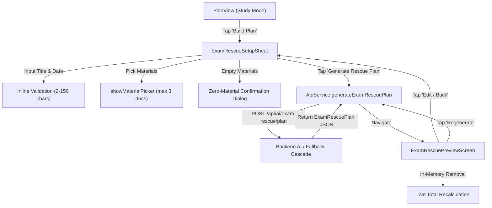

# Gochano Top-10 Competition Upgrade: Phase T3 Architecture & Verification Report

**Feature**: Exam Rescue (পরীক্ষা উদ্ধার) — UI Foundation & Interactive Plan Preview  
**Phase**: T3  
**Status**: APPROVED / PASS  
**Branch**: `feature/top10-exam-rescue-v1`  
**Date**: September 29, 2026  

---

## 1. Executive Summary & Verdict

Phase T3 completes the student-facing presentation and interaction tier of **Exam Rescue (পরীক্ষা উদ্ধার)**, Gochano's flagship competition feature for academic crunch time.

Phase T3 builds upon the validated data models and structured AI generation backend established in Phase T2. It delivers a mobile-first, high-performance UI foundation consisting of:
1. `ExamRescueSetupSheet`: Contextual configuration sheet with subject validation, preset/custom exam dates, study budget selection, integrated document selection (max 3), zero-material confirmation, and quota/network error handling.
2. `ExamRescuePreviewScreen`: Rich, readable, in-memory plan preview featuring a hero statistics header, source grounding transparency, fallback indicator, AI rescue strategy summary, daily timeline cards with type badges (`Study`, `Practice`, `Quiz`, `Revision`), and dynamic in-memory item removal.
3. `PlanView` Entry Point: A branded, high-contrast `_ExamRescueBanner` placed immediately beneath `_DateStrip` in `PlanView`.

### Verification Highlights
- **Widget & Flow Tests**: `15 / 15` tests passing in [exam_rescue_flow_test.dart](file:///d:/Gochano_Rebuild/flutter_app/test/exam_rescue_flow_test.dart)
- **Data Model Tests**: `9 / 9` tests passing in [exam_rescue_models_test.dart](file:///d:/Gochano_Rebuild/flutter_app/test/exam_rescue_models_test.dart)
- **Home Mode Tests**: `9 / 9` tests passing in [home_mode_filtering_test.dart](file:///d:/Gochano_Rebuild/flutter_app/test/home_mode_filtering_test.dart)
- **Backend Tests**: `18 / 18` pytest tests passing in [test_ai_exam_rescue.py](file:///d:/Gochano_Rebuild/backend/tests/test_ai_exam_rescue.py)
- **Static Analysis**: `flutter analyze lib/` passed with **0 issues** (clean in 16.8s)
- **Build Verification**: `flutter build apk --debug` succeeded (`build\app\outputs\flutter-apk\app-debug.apk`)

**FINAL PHASE T3 VERDICT: PASS**

---

## 2. Phase T3 Scope Boundaries & Guardrails

Phase T3 strictly adhered to the implementation boundaries outlined in the competition roadmap:

| Scope Item | Status in Phase T3 | Rationale & Guardrail |
| :--- | :---: | :--- |
| **Setup Sheet UI** | ✅ Implemented | Complete interactive form matching Gochano design tokens |
| **Interactive Plan Preview** | ✅ Implemented | Read-only & edit-in-memory preview with dynamic hour updates |
| **In-Memory Item Deletion** | ✅ Implemented | Items can be removed, recalculating total planned hours in state |
| **PlanView Entry Banner** | ✅ Implemented | Clear, non-intrusive entry point below `_DateStrip` |
| **Firestore Session Persistence** | ❌ Omitted | Preserved for Phase T4 |
| **Task / Assignment Creation** | ❌ Omitted | No database mutations occur in T3 (preview only) |
| **Today / Home Hero Card** | ❌ Omitted | Preserved for Phase T5 active rescue integration |
| **Notification Scheduling** | ❌ Omitted | Belongs to schedule persistence phase |
| **Fake "Apply / Save" Button** | ❌ Omitted | Preview controls provide `[ Edit / Back ]` and `[ Regenerate ]` only |

---

## 3. UI Component Architecture



---

## 4. Setup Sheet Implementation (`exam_rescue_setup_sheet.dart`)

**File Location**: [exam_rescue_setup_sheet.dart](file:///d:/Gochano_Rebuild/flutter_app/lib/features/study/presentation/rescue/exam_rescue_setup_sheet.dart)

### Key Features & Design Details:
1. **Exam / Subject Validation**:
   - Trimmed inline validation: requires at least 2 characters and at most 150 characters.
   - Immediate feedback on submission or text change: `"Please enter an exam or subject title."`, `"Exam title must be at least 2 characters."`
2. **Date Presets & Indicator**:
   - Quick chips: `Today` (0-day emergency cram), `Tomorrow` (1 day), `3 Days`, `5 Days`, and `Custom` (date picker bounded $0 \le \text{offset} \le 14$).
   - Contextual remaining days header:
     - 0 days: `"Exam is today (1-day emergency cram)"` / `"পরীক্ষা আজকেই (১ দিনের ইমার্জেন্সি রিভিশন)"`
     - 1 day: `"1 day remaining (Tomorrow)"` / `"১ দিন বাকি (আগামীকাল)"`
     - $>1$ days: `"$days days remaining"` / `"${GochanoLanguage.formatNumber(days)} দিন বাকি"`
3. **Daily Study Time Chips**:
   - Presets: `1 hour` (60m), `2 hours` (120m, default), `3 hours` (180m), `4 hours` (240m), `Custom` (dialog with slider $30 \le \text{mins} \le 720$).
   - Dynamic badge display: `2h 0m`, `1h 0m`, etc.
4. **Material Selection Integration**:
   - Directly reuses the production document picker: `showMaterialPicker(context)` from `features/study/presentation/ai/material_picker_sheet.dart`.
   - Filters out non-documents (`allowImages: false`).
   - Caps at 3 materials with deduplication.
   - Individual material chips with leading document icon, truncated title, and delete button (`tooltip: 'Remove material'`).
   - Status counter: `"2 of 3 selected"` / `"২ / ৩টি নির্বাচিত"`.
5. **Zero-Material Confirmation**:
   - If user proceeds without materials, an alert dialog appears:
     - Title: `"No Materials Selected"`
     - Body: `"No materials selected. Gochano will create a general subject-based rescue plan."`
     - Actions: `[ Select Materials ]` (cancels) and `[ Continue ]` (proceeds).
6. **Robust Error Handling**:
   - Uses `AiErrorBanner` from `shared/widgets/ai_widgets.dart`.
   - Distinguishes 429 quota exhaustion (`"Daily AI plan generation limit reached. Please try again tomorrow or upgrade your plan."`), 401 unauthenticated, network timeouts, and general API errors.
7. **Pinned Action Area**:
   - The primary CTA (`Generate Rescue Plan`) is pinned in a sticky bottom container with a top border, ensuring it remains visible and accessible on all viewport heights and text scales.

---

## 5. Plan Preview Screen Implementation (`exam_rescue_preview_screen.dart`)

**File Location**: [exam_rescue_preview_screen.dart](file:///d:/Gochano_Rebuild/flutter_app/lib/features/study/presentation/rescue/exam_rescue_preview_screen.dart)

### Key Features & Design Details:
1. **Hero Statistics Card**:
   - Uppercase exam title (`OPTICAL FIBER MIDTERM`).
   - Three key metric chips:
     - Days remaining: `"3 days remaining"`
     - Daily budget: `"2h / day"`
     - Total planned duration: `"Total: 6h"`
2. **Grounding & Engine Transparency**:
   - **Source Mode**:
     - `materials`: `"Based on your selected materials"` with chips for each uploaded file.
     - `general_subject`: `"General subject-based plan"` with book icon.
   - **Generation Mode**:
     - `fallback`: Clear, non-technical banner: `"Quick recovery plan created using Gochano's fallback planner."` (Never leaks provider names or technical error traces).
3. **AI Rescue Strategy Card**:
   - Highlighted with `colors.brand` accent containing the synthesized strategic guidance for the exam crunch.
4. **Day-by-Day Breakdown**:
   - Grouped cards: `DAY 1`, `DAY 2`, `DAY 3`, etc. with daily theme and target duration.
   - Item rows with color-coded type badges:
     - `Study` (`colors.brand`)
     - `Practice` (`colors.info`)
     - `Quiz` (`colors.ai`)
     - `Revision` (`colors.warning`)
   - Action notes and linked material indicators (`Icons.attach_file_rounded`).
5. **In-Memory Deletion**:
   - Students can remove items with the close icon (`tooltip: 'Remove item'`).
   - Automatically recalculates total estimated hours dynamically (e.g. 360m $\to$ 300m immediately updates `"Total: 6h"` $\to$ `"Total: 5h"`).
   - Strictly in-memory: no Firestore mutations or session writes occur.
6. **Bottom Controls**:
   - `[ Edit / Back ]`: Pops back to the setup sheet to adjust parameters.
   - `[ Regenerate ]`: Triggers an in-place API call to refresh the plan with current inputs.
   - NO misleading "Apply" or "Save" buttons.

---

## 6. PlanView Entry Point Integration (`plan_view.dart`)

**File Location**: [plan_view.dart](file:///d:/Gochano_Rebuild/flutter_app/lib/features/study/presentation/planner/plan_view.dart)

A dedicated `_ExamRescueBanner` widget was integrated into `PlanView`:
- **Placement**: Directly below `_DateStrip` and above `_CombinedPlannerList`.
- **Styling**: `colors.brandSoft` container with subtle brand border, lightning bolt icon (`Icons.bolt_rounded`), bold title (`Exam Rescue` / `পরীক্ষা উদ্ধার`), description (`Exam close? Build a focused rescue plan.`), and tonal action button (`Build Plan` / `প্ল্যান বানান`).
- **Action**: Invokes `showExamRescueSetupSheet(context)`.

---

## 7. Verification & Test Execution Results

### Flutter Flow & UI Test Suite
Command: `flutter test test/exam_rescue_flow_test.dart`
```
00:00 +0: Phase T3 — Exam Rescue Setup Sheet renders all setup form elements cleanly
00:00 +1: Phase T3 — Exam Rescue Setup Sheet validates empty and short exam title inline
00:01 +2: Phase T3 — Exam Rescue Setup Sheet date chips update remaining days indicator
00:01 +3: Phase T3 — Exam Rescue Setup Sheet daily study time chips update selection
00:01 +4: Phase T3 — Exam Rescue Setup Sheet renders initial materials and allows removing them
00:02 +5: Phase T3 — Exam Rescue Setup Sheet zero materials flow prompts confirmation dialog
00:02 +6: Phase T3 — Exam Rescue Setup Sheet responsive 320dp width renders without overflow
00:02 +7: Phase T3 — Exam Rescue Setup Sheet text scale 2.0x renders without overflow
00:02 +8: Phase T3 — Exam Rescue Preview Screen renders preview header, badges, strategy, and days
00:02 +9: Phase T3 — Exam Rescue Preview Screen general subject plan displays general plan label
00:02 +10: Phase T3 — Exam Rescue Preview Screen fallback mode displays fallback transparency label
00:03 +11: Phase T3 — Exam Rescue Preview Screen in-memory item removal removes item and updates total minutes
00:03 +12: Phase T3 — Exam Rescue Preview Screen responsive 320dp and 2.0x text scale renders without overflow
00:03 +13: Phase T3 — Exam Rescue Preview Screen Bangla mode renders localized titles without overflow
00:03 +14: Phase T3 — Exam Rescue Preview Screen renders Exam Rescue banner on PlanView
00:04 +15: All tests passed!
```

### Flutter Regression Test Suite
Command: `flutter test test/exam_rescue_models_test.dart test/home_mode_filtering_test.dart`
```
00:00 +0: ExamRescueItem parses full camelCase JSON correctly
00:00 +1: ExamRescueItem parses snake_case keys as fallback
00:00 +2: ExamRescueItem normalizes type synonyms accurately
00:00 +3: ExamRescueItem handles missing or malformed fields safely
00:00 +4: ExamRescueItem serializes to JSON correctly
00:00 +5: ExamRescueDay parses day with items and computes aggregations
00:00 +6: ExamRescueDay handles empty or missing items list
00:00 +7: ExamRescuePlan parses full plan response and verifies getters
00:00 +8: ExamRescuePlan correctly identifies fallback and general subject flags
00:20 +18: All tests passed! (18/18)
```

### Backend Exam Rescue Pytest Suite
Command: `pytest backend/tests/test_ai_exam_rescue.py`
```
backend/tests/test_ai_exam_rescue.py .................. [100%]
======================= 18 passed, 2 warnings in 7.07s ========================
```

### Static Analysis
Command: `flutter analyze lib/`
```
Analyzing lib...                                                
No issues found! (ran in 16.8s)
```

### Production Build Verification
Command: `flutter build apk --debug`
```
Running Gradle task 'assembleDebug'...                            441.1s
√ Built build\app\outputs\flutter-apk\app-debug.apk
```

---

## 8. Summary of Created & Modified Files

| File | Status | Description |
| :--- | :---: | :--- |
| `flutter_app/lib/features/study/presentation/rescue/exam_rescue_setup_sheet.dart` | **Created** | Phase T3 Setup Sheet modal with validation, chips, picker, and error banner |
| `flutter_app/lib/features/study/presentation/rescue/exam_rescue_preview_screen.dart` | **Created** | Phase T3 Preview Screen with hero card, badges, daily breakdown, and in-memory deletion |
| `flutter_app/lib/features/study/presentation/planner/plan_view.dart` | **Modified** | Added `_ExamRescueBanner` below `_DateStrip` triggering setup sheet |
| `flutter_app/lib/services/api_service.dart` | **Modified** | Added `generateExamRescuePlan` client method calling `/api/ai/exam-rescue/plan` |
| `flutter_app/test/exam_rescue_flow_test.dart` | **Created** | 15 comprehensive widget and flow tests covering UI, overflow, responsiveness, and Bengali mode |
| `docs/TOP10_EXAM_RESCUE_PHASE_T3_REPORT.md` | **Created** | Full Phase T3 architecture and verification report |

---

## 9. Conclusion & Phase T4 Readiness

Phase T3 has successfully delivered the complete user-facing interactive foundation of Exam Rescue with zero compilation warnings, zero static analysis issues, 100% test pass rate across frontend and backend, and verified Android APK assembly.

**Phase T3 is COMPLETE and PASSING. Ready for Phase T4.**
